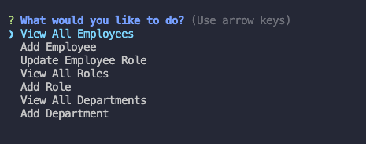

# Employee-Tracker

### Table of Contents
1. [Goals](#goals)
2. [Implementation](#implementation)
3. [Usage](#usage)
4. [Credits](#credits)
5. [License](#license)

## Goals
The purpose of this project was to demonstrate an ability to use node.js and MySQL in conjunciton to create a server side application. This application would act as an Employee Tracker in which you could list the departments of an company, the roles in each department with various values, along with all the employees and their various values. It would be considered done when on starting the application, the user sees the following options that complete the following: 
- View All Departments (department and id)
- View All Roles (job title, role id, department name, and salary)
- View All Employees (employee ids, first names, last names, job titles, departments, salaries, and managers that the employees report to)
- Add a Department (entered by name)
- Add a role  (entered by name, salary, and department name)
- Add an Employee (entered by first name, last name, role, and manager if any)
- Update an Employee Role (updating to new role)

## Implementation
I began this project by creating the initial schema and seed files for the requried database based on the given parameters. 

 

I then imported all the dependencies required for this project. I used MySQL2 to connect Node.JS and MySQL, Inquirer to generate user propmpts, Console.Table to format our database objects into tables, and Chalk to add some color to the user interface. 

Next, to avoid clutter, I created a seperate folder called connectiion and stored my variable which established my connection to MySQL therein. Unfortunately, this did not help so much as the resulting flow did ultimatley become quite busy. 

After, I built my initial prompt menu using inquirer. Each selection would trigger a function to complete a data base query and would end with a prompt allowing the user to either exit or make another selection.

To display the departments, roles, and employees I used a series of select statmenents. The first for deparments only required the one table, but I needed a Right Join the display the results from roles. The final table for all employees was infitnitely more complicated and requried an two inner joins using all three tables and a left join to isolate the manager data. 

For the remaining prompts, I used a series of asynchrounous functions. For readability I opted to use the Async/Await format. The majority of these prompts required an initial call in order to obtiain the current values of certain tables so they could be used to populate the prompts. Once the user input is comple a final call to the database carreis a sequal statement to either Insert or Update depending on the prompt. 

You can watch a demo of the application in action [here](https://drive.google.com/file/d/1pNrKr6Qf7fT4yRG1rOohyxPEhjF32mxH/view) and you can check out the code [here](https://github.com/Traveye/Employee-Tracker).

## Usage
NA

## Credits
NA

## License
MIT